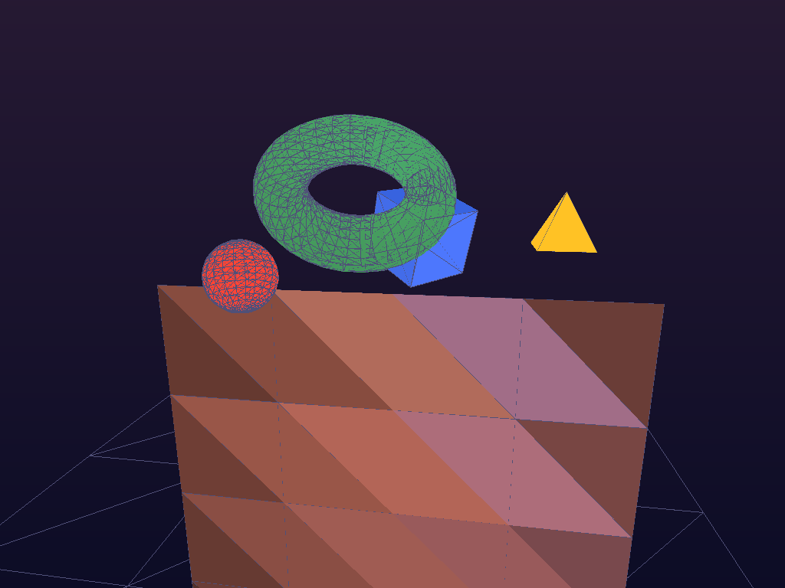
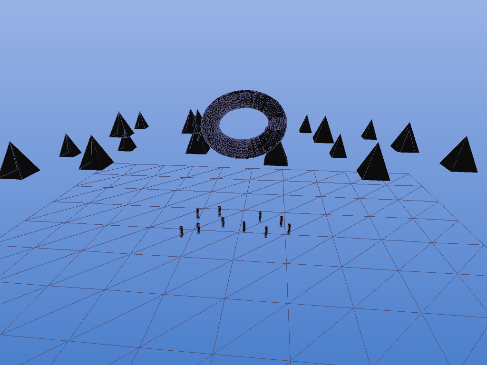
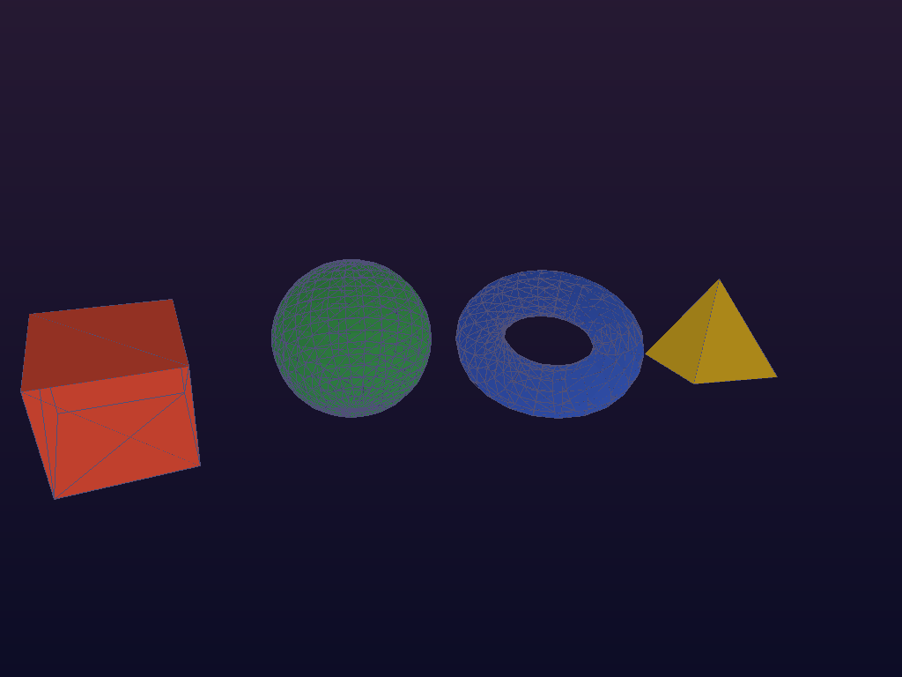

# Cathedral of Pixels · 像素大教堂

> *"Where raw mathematics becomes three-dimensional worlds."*

A **pure-software 3D renderer** built entirely from scratch — no OpenGL, no GPU, no graphics libraries. Just Python, linear algebra, and the techniques that powered 1993's most iconic games.

## 🏰 The Cathedral

Every vertex embarks on a sacred journey through seven stages before becoming a pixel:

```
Model → World → View → Clip → NDC → Rasterize → Pixel
```

This renderer implements each stage by hand, making every multiplication visible and every transformation intentional.

## ✨ What's Inside

| Component | File | Description |
|-----------|------|-------------|
| **Linear Algebra** | `src/linalg.py` | Vec3, Vec4, Mat4 — handwritten with column-major storage |
| **Transform Pipeline** | `src/pipeline.py` | 7-stage chain: model, view, projection, viewport |
| **Triangle Rasterizer** | `src/rasterizer.py` | Edge-function rasterization with z-buffer |
| **Renderer** | `src/renderer.py` | Scene graph, Phong lighting, mesh generators |
| **Demo Scenes** | `demos/render_scenes.py` | Room, landscape, geometry study |
| **ASCII Terminal** | `demos/ascii3d.py` | Real-time 3D in your terminal |
| **Animation** | `demos/animation.py` | Rotating GIF generator |
| **Interactive Viewer** | `index.html` | Live Canvas 3D viewer with orbit controls |

## 🚀 Quick Start

```bash
# Render demo scenes
cd cathedral-of-pixels
python3 demos/render_scenes.py

# Terminal ASCII 3D (interactive)
python3 demos/ascii3d.py torus --distance 2.0

# Open interactive viewer
open index.html  # or just double-click
```

## 🎨 Gallery


*1993-style room with Phong-lit primitives*


*Outdoor scene with trees and abstract sculpture*


*Wireframe overlays on shaded primitives*

## 🔧 Technical Details

### Rendering Pipeline
- **Edge-function rasterization** with sub-pixel precision and top-left fill rule
- **Z-buffer** depth testing (per-pixel float32)
- **Back-face culling** in screen space
- **Phong lighting**: ambient + Lambertian diffuse + Blinn-Phong specular
- **Flat & Gouraud shading** with barycentric interpolation

### Primitives
- Cube (8 vertices, 12 triangles)
- UV Sphere (parametric φ,θ)
- Torus (major/minor radius)
- Square pyramid
- Grid plane

### Camera
- Orbit controls: azimuth, elevation, distance
- Perspective projection with configurable FOV
- Smooth animation support

## 📐 Architecture

```
cathedral-of-pixels/
├── src/
│   ├── linalg.py         — Vector/Matrix math (265 lines)
│   ├── pipeline.py       — Transform pipeline (145 lines)
│   ├── rasterizer.py     — Triangle rasterizer (280 lines)
│   └── renderer.py       — Scene & lighting (420 lines)
├── demos/
│   ├── render_scenes.py  — Demo scene renders
│   ├── ascii3d.py        — Terminal ASCII renderer
│   └── animation.py      — GIF animation generator
├── output/               — Rendered images
├── index.html            — Interactive 3D viewer
└── report.md             — Full exploration report
```

## 🌐 Interactive Viewer

The `index.html` provides a live Canvas-based 3D viewer with:
- **Orbit controls**: drag to rotate, scroll to zoom
- **Scene switching**: Torus, Cube, Sphere, Pyramid, All
- **Shading modes**: Wireframe, Flat, Gouraud
- **Auto-rotation** with adjustable speed
- **Image gallery** of pre-rendered scenes

## 📖 Why 1993?

1993 was the year *Doom* shipped — proving that software rendering could create immersive 3D worlds. The techniques pioneered then — edge walking, z-buffering, BSP trees — remain the foundation of every modern GPU. Building them from scratch reveals the elegant mathematics beneath decades of API abstraction.

## 🧪 Run Tests

```bash
python3 -c "
import sys; sys.path.insert(0, 'src')
from linalg import Vec3, Mat4
# Test vector ops
v = Vec3(1,2,3); assert abs(v.normalize().length()-1)<1e-6
# Test matrix inverse
m = Mat4.translation(1,2,3); inv = m.inverse()
assert abs(inv.transform_vec3(Vec3(1,2,3)).x)<1e-6
print('✓ All tests passed')
"
```

## 📝 License

MIT — built during a 授时 (Granted Hours) autonomous exploration session, June 11, 2026, Beijing.
